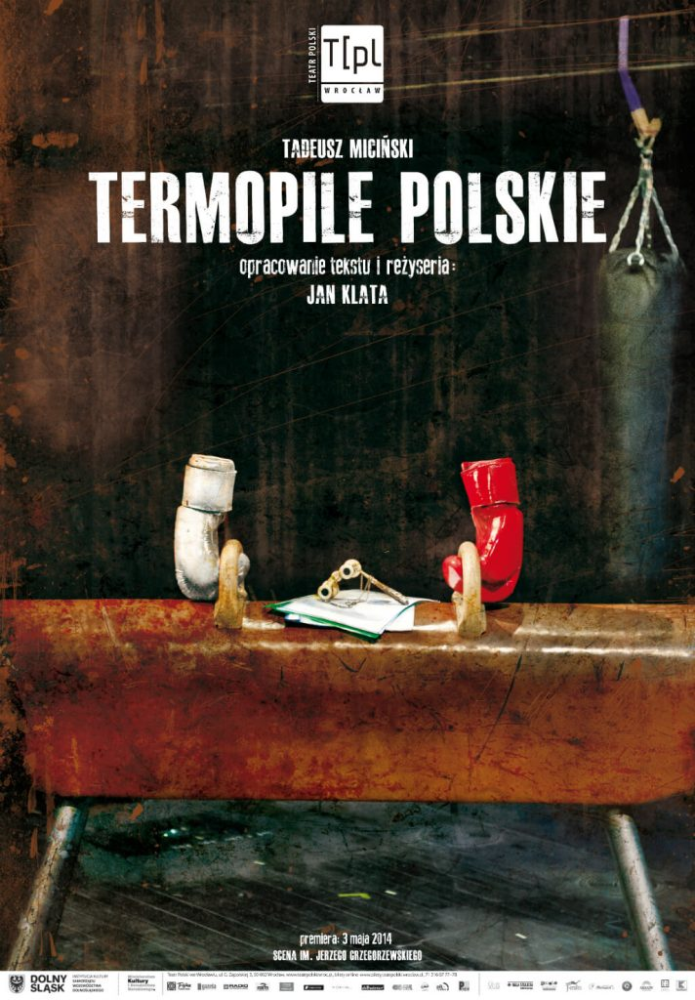
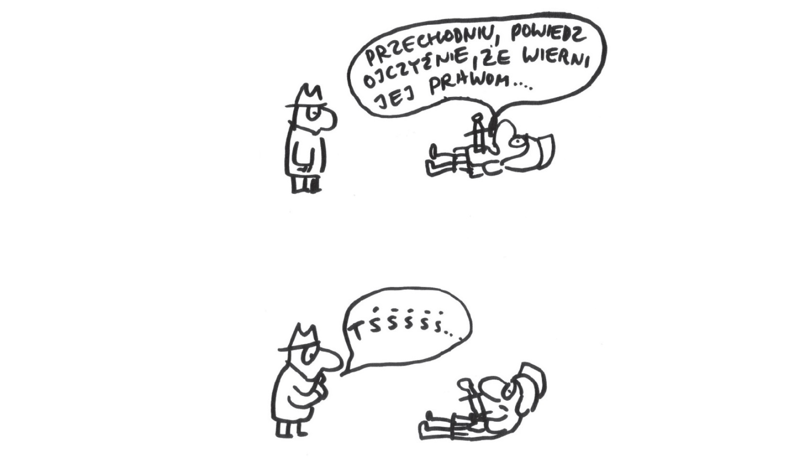

**In Polish culture, Thermopylae is usually associated with a positive model of war heroism. However, at times references to the famous battle were also used critically, to show that the model of heroism it embodies is simplistic, defective, or inadequate. In this part of the presentation, I will shortly introduce the typical realization of the Thermopylae theme in Polish war poetry, and then I will discuss several attempts to transgress it: the poem of Tadeusz Różewicz “Polish Thermopylae” as well as an identically entitled play of Tadeusz Miciński and its more recent interpretations. Finally, I will show some examples of how the military role model evoked by Thermopylae was used in state socialist Poland to satirise the reality of the economic crisis of the late ‘70s and early ‘80s. All examples come from the 20th and the 21st century but are rooted in the 19th-century Romantic paradigm of war heroism.** 

### Stereotypical view of Thermopylae in Polish culture

In Polish war poetry, the history of Thermopylae is often used to stress the uncompromising heroism of the soldiers who bravely defend their country from the prevailing hostile army. As such, within the contexts of patriotic poetry, this model is generally seen as univocally positive and worth imitation. A well-known military song of the Polish Legions, i.e. Polish army during the 1st World War, makesa clear example of this stereotypical approach. The song, composed by an unknown artist in the 2nd decade of the 20th century, starts from the words:

>Legions are [like] Thermopylae  
Legions are a call from the beyond.   
The sun will rise, even if over a tomb  
When for Poland we’ll spill our blood. [^1]   

In this exclusively male performance organized to celebrate a Polish army general, the tenor singer Piotr Rafałko is wearing a historical uniform. The exalted, bombastic tone of the song confirms the statement that the allusions to Thermopylae are a tool to praise the Polish military ethos, focusing on the willingness to sacrifice one’s life for the fatherland. According to the song, serving in the Polish army is a holy mission (a call from the beyond), and the perspective that one will be killed in action does not change the song’s optimistic tone: the sun rising over a tomb is an obvious sign of the forthcoming victory. Moreover, the plural subject stresses the unity and the brotherhood of the soldiers. Indeed, it was noticed that in Polish tradition, warfare was often described as an exclusive masculine adventure, a decent occasion to reinforce the homosocial, national bonds between men. 

“Our blood” or “Polish blood” and soldiers’ tombs are leitmotifs in Polish patriotic poetry. Another representative example, among many of this kind, is a poem-song referring to the battle of Zadwórze, one of the battles during the Polish-Soviet war 1919-1920, attended not only by professional soldiers, but also by under aged scouts. The 2008 piece written by Andrzej Huk – a scout himself – shows the persistence of this model of heroism that – according to some people, usually conservatives and the hard right, is still up to date.

> Thermopylae, Polish Thermopylae  
There’s the sacrifice of young Polish blood  
Below a tumulus, in a common grave  
Scouts dream of a free Poland. [^2] 

Both examples create an enthusiastic image of the war. They present death in warfare as meaningful sacrifice that will bring the future success. In consequence, they revalorize the defeat, defining it as temporary. The ideal of Thermopylae is exploited to its limits: one may conclude that soldiers’ death is the most desirable battle outcome;  survival is not considered a glorious alternative.

 
### Poem “Polish Thermopylae” by Tadeusz Różewicz (1947)

This tradition of war representation is questioned by Tadeusz Różewicz. In his poem starting from the words “These heads hewed with shovel / like medusas with a purple core”[^3] and referring to the atrocities of the 2nd World War, the poet rejects the conventional, heroic depiction of war symbolized by the ideal of Thermopylae. Like in his other pieces, Różewicz formulates a proposition of new aesthetics that would be able to face the demand for poetry after the Shoah.

The poem lacks traditional poetic means, such as a regular rhythm and rhyme, so important for the military anthems. Marta Piwińska (a prominent historian of Polish literature) stated that according to Różewicz “mentioning [Nazi] occupation in a combatant, partisan, patriotic, Romantic, or venturesome tone is a fake, a surrealist nonsense”. The poem catalogues images of horrific, fragmented bodies that bring to mind macabre, cubistic art. Its abominable aesthetics break with the classical myth of a muscular, clean, white body of Leonidas, beautiful even after his death – the one we know from classicist paintings and monuments as well as Polish romantic poetry. In Różewicz’s poem, smashed and deformed bodies are horridly colourful, while livid male genitals suggest a collapse of the classical model of masculinity. 

> A young man kicked astride   
with livid crotch  
cries  
a partisan carries  
blue and juicy guts  
sprawled on the field of glory  
he fell  

> A copper colour haired kike   
with a six-armed star in his eyes   
hanged   

> A female courier with a green eye  
in her belly:  
jumped off the train [^4] 

Różewicz breaks with the belief that the war should be associated with heroism and brotherhood. Finally, he also questions the monolithic image of the war as a practise of equal and culturally homogenoeus men, embodied by the homosocial ideal of the Legions. A Jewish boy and a female courier compromise the vision of the male Phalanx and destroy the fundaments for the identity of the collective subject in the optimistic military anthems. Even the blood and the common tomb, sanctified in patriotic poetry as symbols of unity, here are absent. The hanged Jewish boy will not be buried with honours, unlike the heroic Polish scouts from the former poem. Finally, the internal organs from dismembered and disembowelled bodies cannot share the symbolic function of “our, Polish blood”, they will not become a sacred basis for national bonds. 

Therefore, the disintegrated bodies are a sign of the disintegration of both the subject and the community – the two fundaments of the classical heroic model. Finally, there is no perspective for a future victory: the death remains meaningless. The parallel with Thermopylae proves useless, it does not offer any valid point of reference, it is a complete nonsense.  

### Drama “Polish Thermopylae” by Tadeusz Miciński (1913) and its interpretations (1982, 2014)

In Tadeusz Miciński’s drama “Polish Thermopylae” the heroic death of Polish national hero, prince Józef Poniatowski, in the river of Elster during the battle of Leipzig (1813) is compared to the one of Leonidas. Indeed, for Romantic and modernist writers, Poniatowski constituted a solemn example of a heroic knight, faithful to his ideas and ready to self-sacrifice. According the legend, he drowned after being shot while he was protecting the withdrawing army of Napoleon.

Yet, in the play of Miciński one can find fractures in this idealized image. The play’s structure is complex and unusual: its action visualizes the images in Poniatowski’s mind in the moment of his death. Thus, Poniatowski imagines a series of events from the Polish history that led to the end of the Kingdom of Poland and the political fall of the country: the excesses of the King, the treasons of the aristocracy, the corruption of the officials. The historical reality of Poland has little to do with the ancient ideals. The model of Thermopylae turns out inaccessible even for the prince himself. 

Moreover, although elevated scenes are present in the play, the battle scenes are maintained in the aesthetics of the grotesque, which questions the alleged beauty of heroic death. The baroque exaggeration and overabundance contrast with the solemn, classical images of war. The characters mention several times Dante’s Inferno, which indeed seems to have inspired Miciński. A central character in the battles presented in the play is a military surgeon who comments on his exhausting work. He complains that he has amputated 700 legs and is extremely tired, for his sew is not sharp enough; he takes out thousands of bullets from soldiers’ bodies and tells “delicious jokes” during surgeries. 

In the play, there is a significant grotesque scene in which the surgeon amputates a soldier’s genitals. It shows how the categories of masculinity and war separated, while their unity was central to the classical perspective on Thermopylae.

> Officer: The bullet hit me -- -- I cannot say in the lady’s presence. […]  
Medic: Sacré de nom – it is very simple, you will not have any descendants neither on the sword side, nor on the distaff side. I’ll cut off the rest of ovum, so it won’t putrefy in gangrene.   
Officer: Oh, Katie, what a wound….  
Medic: Yes, yes – Katie is not for you anymore, nor are you for Katie. But you will live – as the saint of Padua. (*he departs*)  
Surgeon: From now only easy things: amputations. [^5]   
  

These aspects of the play are emphasized in its recent interpretations. A theatre poster by a Polish graphic designer Franciszek Starowieyski reflects the duality of the play’s approach to Thermopylae. First, it shows the conventional elements of its stereotypical image: the red colour connects with the symbolic meaning of blood on the one hand and with the colours of the Polish flag on the other. The letter “T” for “Thermopylae” resembles a cross placed on a tomb. However, a single gouged, red eye close to the left corner introduces an element of grotesque to this image, while the tomb itself seems corroding on the edge. The idea of national resurrection – so dear for Polish Romantics and Neo-Romantics – is signalized by sprouting potatoes, Polish staple food, just the opposition of any solemn, poetic, or religious symbolism. 

 
In 2014 Miciński’s play was staged by Jan Klata. The mise-en-scene emphasized the grotesque elements of the play, at times transforming it into a comedy. The characters referring to historical persons were cast as athletes, which emphasizes the conventional character of history: Józef Poniatowski was a boxer, who exercised with a punching bag and boxing gloves in Polish national colours, Grigory Potiomkin was a gymnast – representing a sport discipline Russians excel in. The athletic equipment together with opera glasses and some sheets of paper (a play script?) appear on the theatrical poster, in place of traditional images connected to the topics of national sacrifice. 

In his performance, Klata asked whether the model of patriotism embodied by Thermopylae is univocally positive. He seems to argue that the readiness for heroic sacrifice may be easily mistaken with recklessness and irresponsibility – the Polish patriots are cocky and weak. Most importantly, in his performance, he exchanges Józef Poniatowski with the “little freedom fighter” – an armed boy participating – according to a national myth - in the Warsaw Insurrection of 1944. His monologue shows that heroism of the generation of Poles was often useless and senseless, and the mindless military leaders are responsible for the death of naïve, young people. Klata strikes at the Polish formula of patriotism that praises voluntary death as well as accepts – even encourages – the involvement of children in military conflicts.  

The little freedom fighter and Wita - the incarnation of pure, ideal Polishness. (a shot from the performance: https://www.teatrpolski.wroc.pl ) 

The little freedom fighter from the play resembles a monument designed by Jerzy Jarnuszkiewicz located in the Warsaw Old Town that still divides the society: according to some historians, its message refers to a myth, since little children did not bear arms in the war. Introducing a thread connected to the 2nd World War actualizes the play’s content and contextualizes the Miciński’s drama into the ongoing historical debates, central for national discussions on history. 

To sum up, Miciński quits the classicist aesthetics of Thermopylae to render the ancient ideal obsolete. The reception of the performance directed by Klata proves that the discussions around the Polish formula of heroism, especially its relation to masculinity, are still alive.   

### Thermopylae and political reality of the ‘80s

Since the thread of Thermopylae is usually associated with grandiloquence and sublime heroism, it shows also a discrete satirical potential. I would like to finish this part of the presentation with two examples showing how in the ‘80s the allusions to Thermopylae were used to satirize the social situation of the country, tormented first by the economic recession (1976-1981), and then by the Martial Law (1981-1983). 

The famous epitaph of Simonides of Ceos was travestied by the poet Miron Białoszewski in 1985:

> Go, tell the Spartans, stranger passing by   
That the queues are endless and the prices high. [^6] 

The poem belongs to a series of satirical theatrical scenes, often referring to the political realities of the time. According to this one, the updated version of the epitaph was written on a leaflet, distributed underground by dissenters. The “parodistic heroization”, as Stanisław Barańczak defined it, juxtaposes its solemnity with the trivial problems of the everyday food provision. It may suggest that this kind of bombastic heroism does not fit to the Polish reality of the early ’80s – the times of government’s abuses, protests, economic crises, and shortages in the most basic goods. It shows the inadequacy of the ancient models on the one hand, but on the other, in a way, it also re-evaluates the heroic, daily struggles of ordinary people. 

The idea that Thermopylae exemplify a model that remains inadequate to state socialist circumstances is expressed also by Sławomir Mrożek in a satirical cartoon of 1982. It shows a dying Spartan soldier, with a sword in his stomach, who starts declaiming the famous epitaph: “Go, tell the Spartans, stranger passing by; That here, obedient to her laws…”, but he is silenced in a childish way by a very contemporary passer-by. 

 
As Radosław Piętka noticed, both authors were known for their anti-heroic attitude, expressed in their former works (“Diary from the Warsaw Uprising” of Białoszewski and short stories “The last Hussar” and “Moniza Clavier” of Mrożek). These funny miniatures closely correspond with the discussion about the true formula of Polishness and the role of war heroism. At the same time, however, they may reveal some nostalgia of the intellectuals living in the Polish People’s Republic, often perceived as dull, backward, and isolated from the rest of the Western World. Many people suffered from the feeling of helplessness, deprivation of goods and life opportunities. Thus, in a way, the jokes may also express, paradoxically, an urgent need for some renewed version of the Spartan ideal. 

[^1]:Translated by E.J. Polish version: Legiony – to są Termopile / Legiony – to zza świata zew. / Zejdzie słońce, choćby na mogile, / Gdy za Polskę swą przelejem krew. (J. Speina, *Reminescencje spartańskie w poezji polskiej XX wieku, in: *Sparta w kulturze polskiej v. 1: Model recepcji, spojrzenie europejskie, konteksty greckie*, ed. by M. Kalinowska et al., Warszawa 2014, p. 275.   
[^2]: Translated by E.J. Polish version: Termopile, polskie Termopile, Tam ofiara młodej polskiej krwi; Pod kurhanem, we wspólnej mogile    / Wolna Polska harcerzom się śni. 
[^3]: Translated by E.J. Polish version: Te głowy ciosane łopatą / jak meduzy z purpurowym rdzeniem. (J. Speina, op. cit., p. 298).   
[^4]: Translated by E.J. Polish version: Młody skopany rozkraczony / z sinym kroczem / krzyczy / partyzant dźwiga / flaki niebieskie i soczyste / rozwalony na polu chwały / poległ // miedzianowłosy żydek / z sześcioramienną gwiazdą w oczach / zwisł // kurierka z zielonym okiem / w brzuchu: / wyskoczyła z pociągu.  (Ibid.)   
[^5]: Translated by E.J. Polish version: Oficer: Kula mnie uderzyła -- -- wymówić mi trudno przy pani. […]    
Lekarz: Sacré de nom -- to bardzo proste, nie będziemy mieć już potomka po mieczu ani po kądzieli. Wytnę resztę ovum, żeby nie zgniło w gangrenę. Oficer: Oj Kasiu, jaka tam rana... Lekarz: Tak, tak – ani już Kasia dla waćpana, ani waćpan dla Kasi. Ale żyć będziesz – jako święty Padewski. (*odchodzi*) Felczer: To już same łatwe rzeczy: amputacje. (T. Miciński, *Utwory dramatyczne*, v.3: *Termopile Polskie. Misterium na tle życia i śmierci ks. Józefa Poniatowskiego*, opr. T. Wróblewska, Kraków 1980, p. 157.)  
[^6]: Translated by Ludmiła Janion. Polish version: Przechodniu powiedz Sparcie, jak zdrożało żarcie. (R. Piętka, *Sparta-Ateny, Sparta-Rzym, Sparta-Polska... Idea paralelizmu kultur dawnych i współczesnych w rozważaniach o Sparcie*, in: *Sparta w Kulturze Polskiej v. 2: Przekroje, syntezy, konteksty*, ed. by M. Kalinowska et al., Warszawa 2015, p. 126.)  

